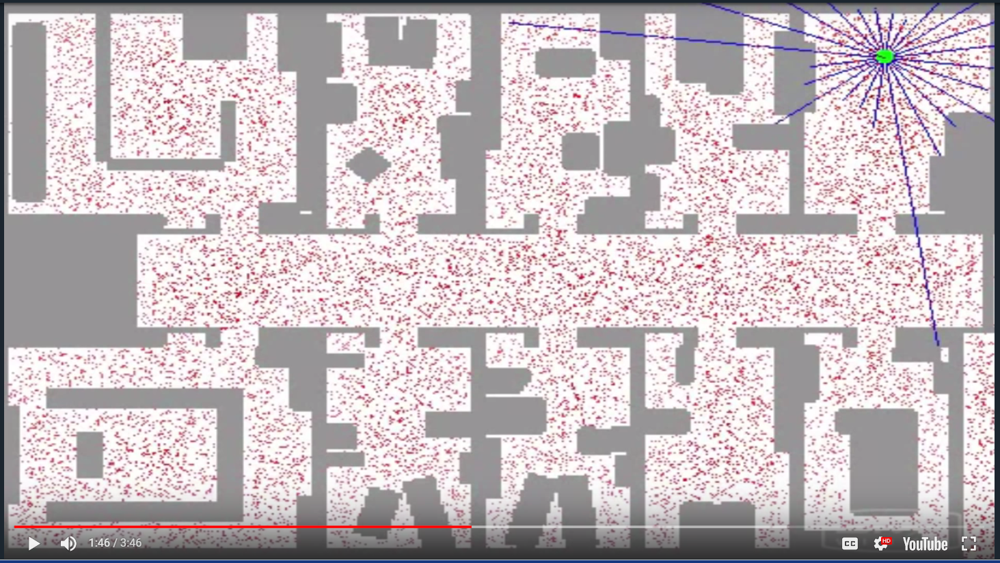

# CarND-Kidnapped-Vehicle-Project


# Project Goals
---
The goal of this project are the following:

* Implement a 2D Particle Filter in C++.
* Localize a vehicle given observations and landmarks in a map. 
* Summarize the results with a written report.


# Global Localization
---
Consider this image:



The Vehicle has no clue about where it is and it has to find out where it is based on sensor measurements.
This vehicle has range sensors(Radar/Lidar) as indicated by blue stripes. Vehicles has to use these range sensors observations to determine a good posterior distribution as to where it is. What it doesn't know is it's starting in the middle of a corridor (in the picture), in fact it is completely uncertain as to where it is at the start.The particle filter represents this using particles.Each of the red dots  in picture, of which there can be several thousand here, is a discrete guess where robot might be.

Its structured as an X and Y coordinate pair and a heading direction and these 3 values together comprise a single guess,but a single guess is not a filter,it is the set of several thousands of such guesses that together comprise an approximate representation for the posterior of the robot.

In the beginning the particles are uniformly spread but the particle filter makes them survive in proportion of how consistent these particles are with the sensor measurement.The thickness of a particle represents it's weight in the given particle cloud. 

In the image, vehicle can figures out that it's in the corridor, but 2 clouds of particles will survive because of the symmetry of the corridor. As the vehicle enter 1 of the offices, the symmetry is broken and the correct set of particles survive.
The essence of the particle filter is to have these particles guess where the vehicle might be moving but also have them survive using effectively survival of the fittest so that particles that are more consistent with the measurements are more likely to survive and as a result higher probability (weight) will collect more particles, and therefore will be more representative of the robot's posterior belief.Those particles surviving  particles are  clustered in a single location. Those comprise the approximate belief of the robot as it localizes itself.

*This description is derived from Sebastian Thrun's Particle filter explanation video*

* 100 particles works with sampling wheel while STL discrete_distribution failed once
* 250 particles works for STL discrete_distribution  but fails for sampling wheel
* 500 works for both STL discrete_distribution and sampling wheel

# Overview of the Project
---

Particle filters have state space which is continuous and it's belief is multi-modal.They are very easy to program.


A critical module in the working of a self driving vehicle is the localizer or localization module. Localization can be defined as predicting the location of vehicle with high accuracy in the range 3-10 cm. This location is in reference to a global map of the locality in which the self driving vehicle is either stationery or moving.

One way to localize a vehicle is by using data from Global Positioning System (GPS), which makes use of triangulation to predict the position of an object detected by multiple satellites. But GPS doesn't always provide high accuracy data. For e.g.: In case of strong GPS signal, the accuracy in location is in the range of 1-3 m. Whereas in the case of a weak GPS signal, the accuracy drops to a range of 10-50 m. Hence the use of only GPS is not reliable and desirable.

To achieve an accuracy of 3-10 cm, sensor information from Laser sensor (LIDAR) and/or Radial distance and angle sensor (RADAR) is used and fused together using a Particle Filter. This process is demonstrated in the following sections.


# Overview
This repository contains all the code needed to complete the final project for the Localization course in Udacity's Self-Driving Car Nanodegree.

#### Submission
All you will submit is your completed version of `particle_filter.cpp`, which is located in the `src` directory. You should probably do a `git pull` before submitting to verify that your project passes the most up-to-date version of the grading code (there are some parameters in `src/main.cpp` which govern the requirements on accuracy and run time.)

## Project Introduction
Your robot has been kidnapped and transported to a new location! Luckily it has a map of this location, a (noisy) GPS estimate of its initial location, and lots of (noisy) sensor and control data.

In this project you will implement a 2 dimensional particle filter in C++. Your particle filter will be given a map and some initial localization information (analogous to what a GPS would provide). At each time step your filter will also get observation and control data. 

## Running the Code
This project involves the Term 2 Simulator which can be downloaded [here](https://github.com/udacity/self-driving-car-sim/releases)

This repository includes two files that can be used to set up and intall uWebSocketIO for either Linux or Mac systems. For windows you can use either Docker, VMware, or even Windows 10 Bash on Ubuntu to install uWebSocketIO.

Once the install for uWebSocketIO is complete, the main program can be built and ran by doing the following from the project top directory.

1. mkdir build
2. cd build
3. cmake ..
4. make
5. ./particle_filter

Alternatively some scripts have been included to streamline this process, these can be leveraged by executing the following in the top directory of the project:

1. ./clean.sh
2. ./build.sh
3. ./run.sh

Tips for setting up your environment can be found [here](https://classroom.udacity.com/nanodegrees/nd013/parts/40f38239-66b6-46ec-ae68-03afd8a601c8/modules/0949fca6-b379-42af-a919-ee50aa304e6a/lessons/f758c44c-5e40-4e01-93b5-1a82aa4e044f/concepts/23d376c7-0195-4276-bdf0-e02f1f3c665d)

Note that the programs that need to be written to accomplish the project are src/particle_filter.cpp, and particle_filter.h

The program main.cpp has already been filled out, but feel free to modify it.

Here is the main protcol that main.cpp uses for uWebSocketIO in communicating with the simulator.

INPUT: values provided by the simulator to the c++ program

// sense noisy position data from the simulator

["sense_x"] 

["sense_y"] 

["sense_theta"] 

// get the previous velocity and yaw rate to predict the particle's transitioned state

["previous_velocity"]

["previous_yawrate"]

// receive noisy observation data from the simulator, in a respective list of x/y values

["sense_observations_x"] 

["sense_observations_y"] 


OUTPUT: values provided by the c++ program to the simulator

// best particle values used for calculating the error evaluation

["best_particle_x"]

["best_particle_y"]

["best_particle_theta"] 

//Optional message data used for debugging particle's sensing and associations

// for respective (x,y) sensed positions ID label 

["best_particle_associations"]

// for respective (x,y) sensed positions

["best_particle_sense_x"] <= list of sensed x positions

["best_particle_sense_y"] <= list of sensed y positions


Your job is to build out the methods in `particle_filter.cpp` until the simulator output says:

```
Success! Your particle filter passed!
```

# Implementing the Particle Filter
The directory structure of this repository is as follows:

```
root
|   build.sh
|   clean.sh
|   CMakeLists.txt
|   README.md
|   run.sh
|
|___data
|   |   
|   |   map_data.txt
|   
|   
|___src
    |   helper_functions.h
    |   main.cpp
    |   map.h
    |   particle_filter.cpp
    |   particle_filter.h
```

The only file you should modify is `particle_filter.cpp` in the `src` directory. The file contains the scaffolding of a `ParticleFilter` class and some associated methods. Read through the code, the comments, and the header file `particle_filter.h` to get a sense for what this code is expected to do.

If you are interested, take a look at `src/main.cpp` as well. This file contains the code that will actually be running your particle filter and calling the associated methods.

## Inputs to the Particle Filter
You can find the inputs to the particle filter in the `data` directory. 

#### The Map*
`map_data.txt` includes the position of landmarks (in meters) on an arbitrary Cartesian coordinate system. Each row has three columns
1. x position
2. y position
3. landmark id

### All other data the simulator provides, such as observations and controls.

> * Map data provided by 3D Mapping Solutions GmbH.

## Success Criteria
If your particle filter passes the current grading code in the simulator (you can make sure you have the current version at any time by doing a `git pull`), then you should pass! 

The things the grading code is looking for are:


1. **Accuracy**: your particle filter should localize vehicle position and yaw to within the values specified in the parameters `max_translation_error` and `max_yaw_error` in `src/main.cpp`.

2. **Performance**: your particle filter should complete execution within the time of 100 seconds.

## How to write a README
A well written README file can enhance your project and portfolio.  Develop your abilities to create professional README files by completing [this free course](https://www.udacity.com/course/writing-readmes--ud777).


