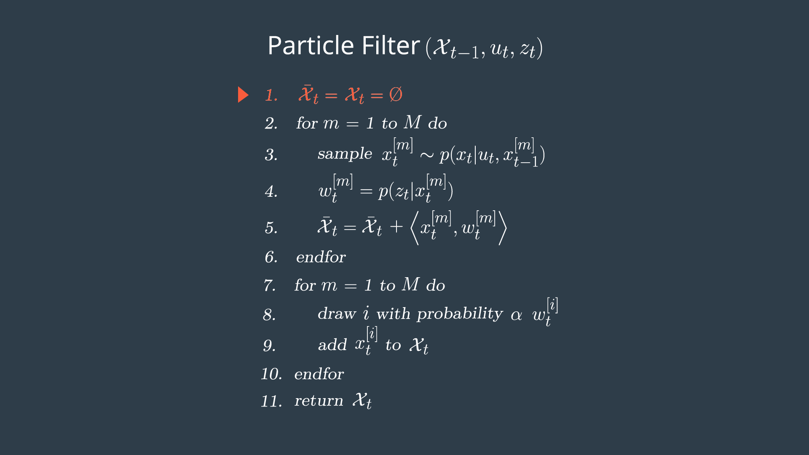
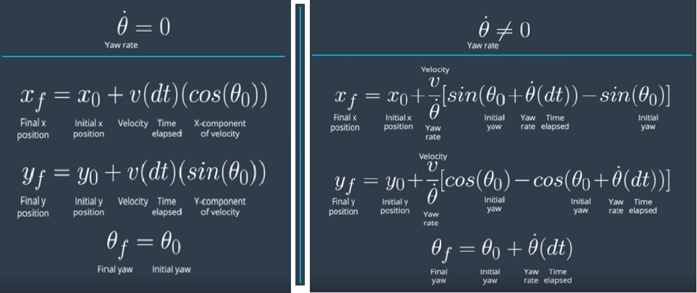
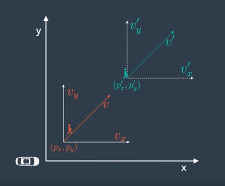
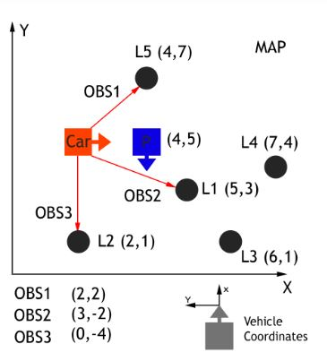
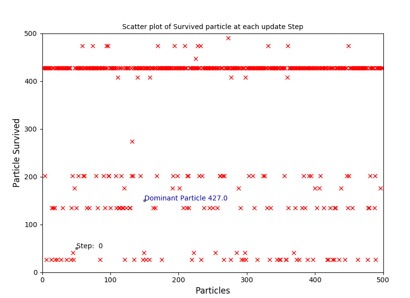
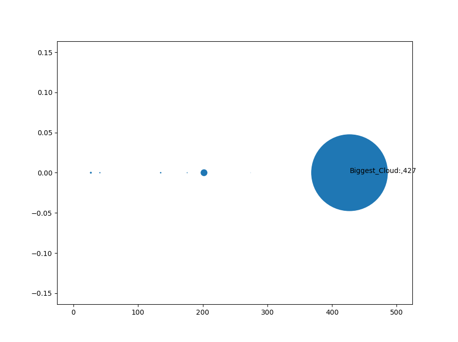

# CarND-Kidnapped-Vehicle-Project

# Project Goals
---
The goal of this project are the following:

* Implement a 2D Particle Filter in C++.
* Localize a vehicle given observations and landmarks in a map. 
* Summarize the results with a written report.

# Global Localization with particle filter
---
Consider this image:

The Vehicle has no clue about where it is and it has to find out with accuracy of 5-10 cm where it is. Global Positioning System (GPS) can be used for localization, which makes use of triangulation to predict the position of an object detected by multiple satellites. GPS accuracy is not sufficient for localization in driving conditions.Strong GPS signal has the accuracy in the range of 1-3 m and for weak GPS signal, the accuracy drops to a range of 10-50 m. Hence the use of only GPS is not reliable.

To achieve high accuracy for vehicle localization, sensor information from RADAR and LIDAR is used. The vehicle in image has range sensors(Radar/Lidar) as indicated by blue stripes in the image.

Vehicles has to use these range sensors observations to determine a good posterior distribution as to where it is. What it doesn't know is it's starting in the middle of a corridor (in the picture), in fact it is completely uncertain as to where it is at the start.The particle filter represents this using particles.Each of the red dots  in picture, of which there can be several thousand here, is a discrete guess where robot might be.

Its structured as an X and Y coordinate pair and a heading direction and these 3 values together comprise a single guess,but a single guess is not a filter,it is the set of several thousands of such guesses that together comprise an approximate representation for the posterior of the vehicle.

In the beginning the particles are uniformly spread but the particle filter makes them survive in proportion of how consistent these particles are with the sensor measurement.The thickness of a particle represents it's weight in the given particle cloud. 

In the image, vehicle can figure out that it's in the corridor, but 2 clouds of particles will survive because of the symmetry of the corridor. As the vehicle enter 1 of the offices, the symmetry is broken and the correct set of particles survive.
The essence of the particle filter is to have these particles guess where the vehicle might be moving but also have them survive using effectively survival of the fittest so that particles that are more consistent with the measurements are more likely to survive and as a result higher probability (weight) will collect more particles, and therefore will be more representative of the robot's posterior belief.These surviving  particles are  clustered in a single location. Those comprise the approximate belief of the robot as it localizes itself.

Particle filters have state space which is continuous and it's belief is multi-modal.They are very easy to program.

*This description is derived from Sebastian Thrun's Particle filter explanation video*

# Overview of the Project
---

In this project, Particle Filer is used to Localize the vehicle.This driving environment is based on Udacity's self driving car [simulator](https://github.com/udacity/self-driving-car-sim/releases). The vehicle travels through the environment and takes  2444 steps with change in orientation and position. The implemented Particle Filter based Localization predicts the location of vehicle.The Particle Filter program is implemented in C++. There is an upper limit of time(100s) within which the vehicle shall localize itself within given error limits for x,y and heading direction. The simulator show the error values at each step, shows stripe lines to landmarks and indicates failure (error > limit or vehicle runs out of time,100s) or success (error within limit).

The Steps in Localization are depicted in image below and described thereafter.

 *Steps in Localization with Particle Filter*

* Choose number of particles to implement and Initialize their x,y,heading parameter from GPS measurement (with noise).
* Predict motion using CTRV model
* Update weights:
	* For each particle, find landmark that are in certain range (to reduce calculation time),transform observations from sensors to map co-ordinates and associate each observation(measurement from sensors), to appropriate landmark(nearest neighbor).
	* Use observations and associated landmarks to update weight of particles.
* Re-sample particles with replacement (importance sampling). Particles with higher weights (closer to vehicle) would survive at higher rate.

 *Particle Filter Pseudo-code*

# Initialize number of Particles and location

The first step is to choose number of particles to use for localization.Various values of particles were tried and found 500 particles to be sufficient for localization.

The particles position and heading direction is initialized with GPS co-ordinates.Considering GPS data is noisy, the particles were initialized to locations with mean of GPS position and noise added with normal distribution using standard deviation of GPS measurement uncertainty.

# Predict motion using CTRV model
The details of CTRV motion model can be found in [UKF](https://github.com/atul799/CarND-Unscented-Kalman-Filter-Project) project.

Here are the motion equations:
 *Equations for Predictions*

# Update weights
This step involves updating weight of each particle based on consistency of observations and landmarks with regards to particle's current position and heading.

### Find landmark that are in certain range
This step is useful to improve performance. Landmark list is shortened to only consider those that are in sensor_range (50m in this project) at each step.

### Transform observations from sensors to map co-ordinates
The measurement data (observations) from RADAR/LIDAR sensors are received as x,y,heading. In addition there is noise associated with these measurements. These sensors are installed on the vehicle hence, the observations are in coordinate axes relative to the direction of motion of vehicle. 

 

*Vehicle axis, X axis is direction of motion of the vehicle and Y axis is perpendicular to X axis to the left.*

These observations needs to be mapped to map coordinate system. Homogenous Coordinate Transformation is used to do this mapping.
 *Homogenous ransform*

xm, ym is the transformed observation, xc, yc is the observations in vehicle's coordinate  and xp, yp the location of particle in global map coordinate.

### Associate each observation, to appropriate landmark(nearest neighbor)

In the image below,the landmarks are L1-L5, the observations (in vehicle's coordinates system) are OBS1-OBS3,ground truth of vehicle is in Red and predicted location of vehicle (Partcile) is in Blue.

 
*Global Map and it's components*

The Observations are mapped to map co-ordinates in previous step. Now, each observation needs to be associated to a landmark. This is done using nearest neighbor algorithm. In the nearest neighbor algorithm,Euclidean distance between an observation and all landmarks (filtered landmark list) is calculated and the landmark with shortest distance to observation is assigned to the observation. Multiple observations may be associated to a single landmark.

### Use observations and associated landmarks to update weight of particles
After associating observations to landmarks, weight of the particles is updated by using Multivariate Gaussian distribution. 

 *Multi-Variate Gaussian*

The weight of a particle is multiplication of weight contributed by each observation/landmark pair.
At each step, particle weights can be reinitialized to 1 before update or weights can be normalized after update.

# Re-sample particles with replacement

Resampling of particles is based on weight of the particles. Particle with higher weight has higher probability to survive which makes sense as particle with higher weight is more consistent with observations from sensors and hence represent particles closer to actual position of vehicle.

The C++ STL function discrete_distribution is used for resampling of the particles.

 *Resampling and Particle survival*

The image above shows the particle id with it's survival (number on y axis) count. Particle 427
gets resampled most and represents the particle closest to vehicle.By 40th step, particle 427 is identified as the closest to vehicle and all other particles disappear.

Another view of particles that is closest is by looking at particle that is sampled most.

 *Resampling and Particle survival*

Here the thickness of scatter point shows how many times a particle is sampled during the vehicles moves (4244 steps), Particle 427 is sampled most times.

# Result
The implemented Particle filter was tested with [simulator](https://github.com/udacity/self-driving-car-sim/releases).

 *Particle filter in simulator*

The implementation passes the criterion implemented in simulator.

# Running the code
To compile and run the Particle Filter code, following steps are required:
(Assuming uWebSocketIO is complete)

1. cd build
2. cmake ..
3. make
4. ./particle_filter
5. open unity Simulator, choose data and run

The C++-code implementing Particle Filter are in directory src in this repo.

A python post-processing script,particle_cloud_plot.py, is included to post process data and generate particle cloud plots and animation.

## Notes
* normalizing of re-initializing the weights at each step is important. Reinit with 1 or normalizing produces same result.
* The dataAssociation method introduces a redundant loop and can be avoided by associating obs to landmark while updating weights. 
* 100 particles works with sampling wheel while STL discrete_distribution failed once
* 250 particles works for STL discrete_distribution  but fails for sampling wheel
* 500 works for both STL discrete_distribution and sampling wheel

